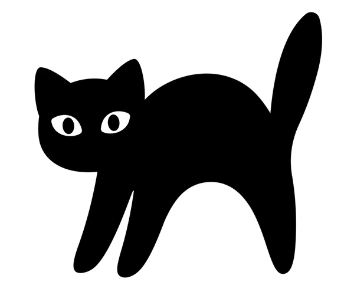

+++
date = '2025-12-24T01:04:27-08:00'
draft = false
title = 'Hello World'
+++


# Hello!

That's it :-)

And here is the cross entropy:


## Cross Entropy Loss

For a classification problem with \\( C \\) classes, the cross entropy loss is defined as:

```katex
L = -\sum_{i=1}^{N} \sum_{c=1}^{C} y_{i,c} \log(\hat{y}_{i,c})
```

where:
- \\( N \\) is the number of samples
- \\( C \\) is the number of classes
- \\( y_{i,c} \\) is the true label (1 if sample \\( i \\) belongs to class \\( c \\), 0 otherwise)
- \\( \hat{y}_{i,c} \\) is the predicted probability that sample \\( i \\) belongs to class \\( c \\)

For binary classification (2 classes), this simplifies to:

```katex
L = -\frac{1}{N} \sum_{i=1}^{N} \left[ y_i \log(\hat{y}_i) + (1-y_i) \log(1-\hat{y}_i) \right]
```

# You can add image



